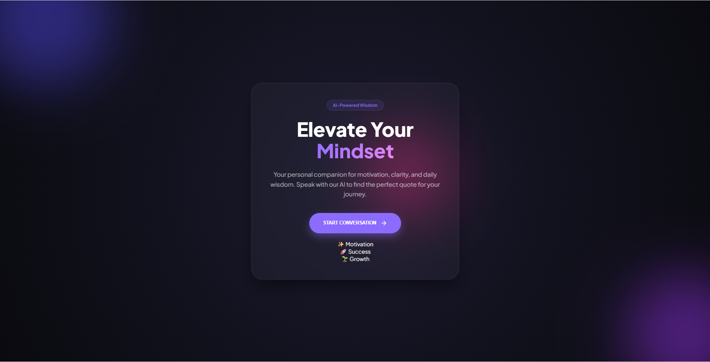
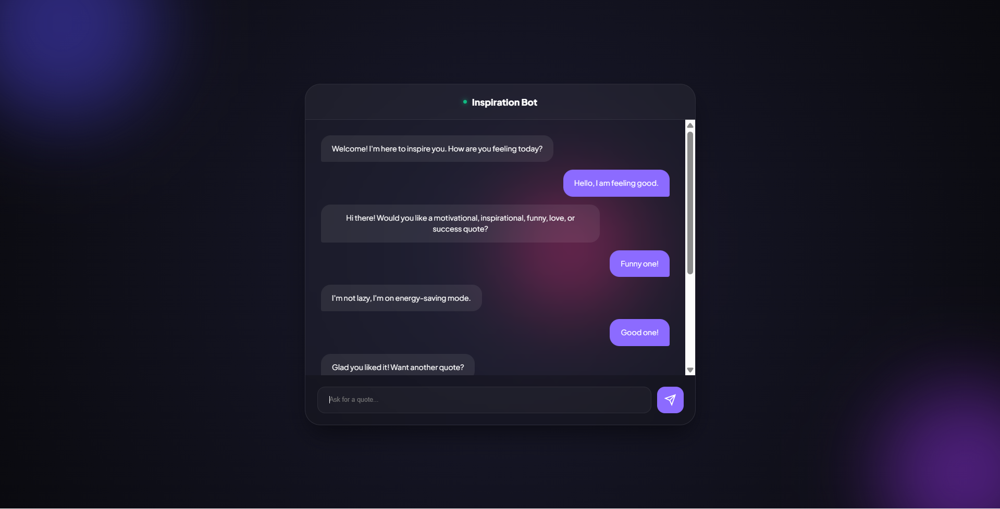

# 🤖 Quotes Recommendation Chatbot using NLP

## 📌 Project Overview

The **Quotes Recommendation Chatbot** is an AI-powered conversational system designed to recommend motivational, inspirational, love, funny, and success quotes based on user input.

The chatbot uses **Natural Language Processing (NLP)** through the **Rasa framework** to understand user queries and provide appropriate responses. A **Flask-based web interface** enables users to interact with the chatbot through a browser instead of the command-line interface.

This project demonstrates how NLP-based conversational agents can be integrated with a modern web interface to create an interactive and user-friendly chatbot system.

---

# ✨ Features

* Natural Language Understanding using **Rasa NLP**
* Intent recognition for different quote categories
* Interactive **web-based chat interface**
* Real-time chatbot responses
* REST API communication between frontend and backend
* Glassmorphism styled modern UI
* Support for multiple quote categories:

  * Motivation
  * Inspiration
  * Love
  * Funny
  * Success

---

# 🧠 Technologies Used

| Technology | Purpose                              |
| ---------- | ------------------------------------ |
| Python     | Backend programming                  |
| Rasa       | NLP and chatbot engine               |
| Flask      | Web server for UI                    |
| HTML       | Frontend structure                   |
| CSS        | UI styling                           |
| JavaScript | Client-side interaction              |
| REST API   | Communication between UI and chatbot |

---

# 📂 Project Structure

```
quotes_chatbot
│
├── data
│   ├── nlu.yml
│   ├── stories.yml
│   └── rules.yml
│
├── models
│
├── tests
│   └── test_stories.yml
│
├── static
│   └── style.css
│
├── templates
│   └── index.html
│
├── app.py
├── config.yml
├── credentials.yml
├── domain.yml
├── endpoints.yml
└── README.md
```

---

# ⚙️ System Requirements

* Python **3.8 – 3.10**
* Pip package manager
* Internet connection
* Web browser

---

# 🛠️ Installation Guide

## 1️⃣ Clone the Repository

```bash
git clone https://github.com/yourusername/quotes-recommendation-chatbot.git
cd quotes-recommendation-chatbot
```

---

## 2️⃣ Create Virtual Environment

```bash
python -m venv venv
```

Activate environment:

### Windows

```bash
venv\Scripts\activate
```

### Linux / Mac

```bash
source venv/bin/activate
```

---

## 3️⃣ Install Required Libraries

```bash
pip install rasa flask requests
```

---

# 🤖 Training the Chatbot

Train the Rasa model:

```bash
rasa train
```

This will create a trained model inside the **models** directory.

---

# 🚀 Running the Chatbot

## Step 1: Start Rasa Server

```bash
rasa run --enable-api --cors "*"
```

The chatbot server will run on:

```
http://localhost:5005
```

---

## Step 2: Run the Web Application

Open a new terminal and run:

```bash
python app.py
```

Flask server will run on:

```
http://127.0.0.1:5000
```

---

# 🌐 Web Application

The web interface allows users to interact with the chatbot through a modern chat UI.

Users can:

* Ask for motivational quotes
* Request inspirational quotes
* Ask for love quotes
* Request funny quotes
* Ask for success quotes

The interface communicates with the Rasa backend using the **REST API**.

---

# 🖼️ Application Screenshots

## Landing Page



## Chat Interface


(screenshots/chat1.png)

---

# 🔄 Chatbot Workflow

```
User Input
     ↓
Web Interface (HTML + JS)
     ↓
Flask Server
     ↓
Rasa REST API
     ↓
NLP Model (Intent Detection)
     ↓
Bot Response
     ↓
Displayed in Web Interface
```

---

# 🧪 Testing

Automated testing is performed using:

```
rasa test
```

This validates:

* Intent recognition
* Dialogue consistency
* Conversation flow

---

# 📈 Future Improvements

* Integration with quote APIs
* Database for dynamic quotes
* Voice-based interaction
* Chat history storage
* Mobile-friendly UI
* Deployment on cloud platforms

---

# 👨‍💻 Author

**Harshit Nainwal**

B.Tech Computer Science Engineering

---

# 📜 License

This project is for **educational purposes** and can be used for learning NLP chatbot development.
